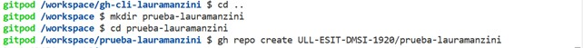
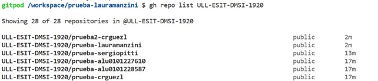
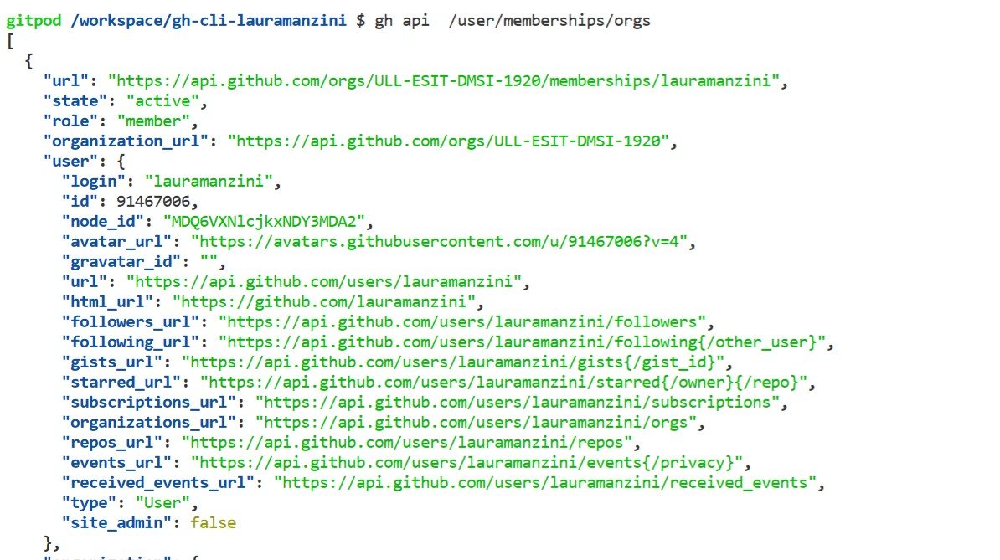

# Práctica 3: gh-cli
**Laura Manzini**

alu0101531700@ull.edu.es

1. [Introducción](intro)
2. [gh create repo](create)
3. [gh delete repo](delete)
4. [gh alias](#alias)
  * [gh alias set](#aliasset)
  * [gh alias list](#aliaslist)
  * [gh alias delete](#aliasdelete)
5. [Seleccionar las organizaciones a las que se apartenece](#selectorgs)
6. [gh org list](#orglist)


<a name = "intro"><a>
## 1. Introducción

El comando `gh` es el comando de GitHub que se emplega en el terminal.

<a name = "create"><a>
## 2. gh create repo

En primero lugar para crear un repositorio sobre gitpod es necesario autenticarse ejecutendo el codigo 
`gh auth login`.

Será necesario generar un token  sobre en su perfil de GitHub y luege pegarlo sobre el terminal.


Un vez que nos encontramos en nuestro _workspace_ es posible crear un repositorio ejecutando el codigo `gh repo create ULL-ESIT-DMSI-1920/prueba-lauramanzini` se puede crear el repositorio.



En nuestro caso el repositorio será parte de la organización ULL-ESIT-DMSI-1920.

Para visualizar una lista de los repositorios que estan entre la organización se ejecuta `gh repo list ULL-ESIT-DMSI-1920`.



<a name = "delete"><a>
## 3. gh delete repo

Para eliminar un repositorio se utiliza el comando `gh api` para tener una lista de los _flags_ que son disponibles para el comando.


El flag `-X` nos dice que va a ser posible utilizar uno de los metodos (get,delete ...) para cambiar los repositorios.

Se puede consultar la documentación para eliminar un repositorio se encuentra en [las referencias de los repositorios API](https://docs.github.com/en/rest/reference/repos). 

Desde la documentación podemos ver como a través del comando `curl` es posible eliminar el repositorio.

Ejecutando el codigo:

```
curl \
  -X DELETE \
  -H "Accept: application/vnd.github.v3+json" \
  https://api.github.com/repos/ULL-ESIT-DMSI-1920/prueba-lauramanzini
```

El comando `curl` no va a funcionar por que no se encuentra la documentación necesaria para hacer el cambio.

Entoncés se utiliza el comando `gh api`:

```
gh api \
  -X DELETE \
  -H "Accept: application/vnd.github.v3+json" \
  https://api.github.com/repos/ULL-ESIT-DMSI-1920/prueba-lauramanzini
```


<a name = "alias"><a>
## 4. gh alias

El comando `gh alias` se utiliza para semplificar y crear _shortcut_ para todos los comandos de gh que se utilizan más frecuentemente. La [documentación](https://cli.github.com/manual/gh_alias) explica como utilizar el comando.

Es importante explicitar todos los _arguments_ y también los _flags_ del comando de lo que se quiere hacer el alias.

El comando base que se utiliza para hacer un alias es el siguiente:

 `gh alias <comando> [flags]`

 Los comandos que son disponibles para el utilizo de alias son los siguientes:

 * delete
 * list
 * set

 Se puede requisir la lista compleda de todos los argomentos ejecutando `gh alias <comando> --help`

<a name = "aliasset"><a>
 ## alias set

El comando de alias `set` permite que crear un nuevo alias. Creamos por ejemplo para el comando `gh repo list`. En este caso el alias que utilizaremos serà `list`.


Se nota cómo **no** se pone el comando *gh* entre los ápices del comando que nos quieremos hacer el alias. 

<a name = "aliaslist"><a>
 ## alias list

Para obtener una lista de los alias que se han credo se utiliza el comando `gh alias list`.


<a name = "aliasdelete"><a>
 ##  alias delete

 Para eliminar un alias se utiliza el comando `gh alias delete <alias>`


<a name = "selectorgs"><a>
## 5. Seleccionar las organizaciones a las que se apartenece

Para ver todas las organizaciones a las que pertenezco utilizo el comando  se consulta la [documentación de GitHub](https://docs.github.com/en/rest/reference/orgs#list-organization-memberships-for-the-authenticated-user) y se encuentra el comando `gh api  /user/memberships/orgs` que nos permite de obtener una lista de todas las afiliaciones a organizaciones.



Añadendo el comando `| jq` al final se puede acceder al file .json con todas las informaciones sobre las organizaciones a las que el mi perfil de GitHub está asociado.

El file json que obtenimos es un file que es muy largo y a veces bastante dificil de entender. Para solucionar este problema se utiliza el comando `--paginate` realice solicitudes HTTP adicionales para obtener todas las páginas de resultados.

Ejecutamos `gh api --paginate /user/memberships/orgs | jq`.


Para obtener las informacciones que están contenida en el file json que hemos obtenido es necesario instalar el [jq json queries](https://stedolan.github.io/jq/). Esta herramienta nos permite de acceder a las informaciones contenida en qualquier file json.

Los comandos más utilizados se pueden consultar al siguiente [enlace](https://stedolan.github.io/jq/manual/#Basicfilters).

Después de instalar la herramienta se ejecuta el codigo `brew install jq` sobre GitPod 


El file json es un array de elementos y para acceder a esos se utiliza la siguiente reglas:

* Se utilizan las comillas simples '' para indicar los elementos del file json que queremos ver
* En los corchetes ponemos la posicción del elemento del array que queremos seleccionar
* Despues de los corchetes ponemos un punto `.` cada vez que queremos acceder a uno de los elementos del elemento del array seleccionado el los corchetes

Por ejempo ejecutando el codigo `gh api /user/memberships/orgs | jq '.[0]'` obtenimos todas las informaciones relativo a el primero elemento del array, es decir el elemento que es en la posicción 0 del array.

Una otra manera de obtener las misma informaciones pero en formato diferente es ejecutando el codigo `gh api /user/memberships/orgs --jq '.[0]'`

Para acceder a las organizaciones a las que apartenezco es necesario acceder en primero al campo *organizations* y luego al campo *login* de lo mismo. Se ejecuta `gh api /user/memberships/orgs jq '.[].organization.login'`.


<a name = "orgslist"><a>
## 6. orgs-list

El objectivo ahora es crear un comando alias que nos permite de acceder a las organizaciones. El comando que se ejecuta para obtener esta información es `gh api /user/membership/orgs | jq '.[].organization | .login, .url'`


[](https://classroom.github.com/online_ide?assignment_repo_id=6022596&assignment_repo_type=AssignmentRepo)
